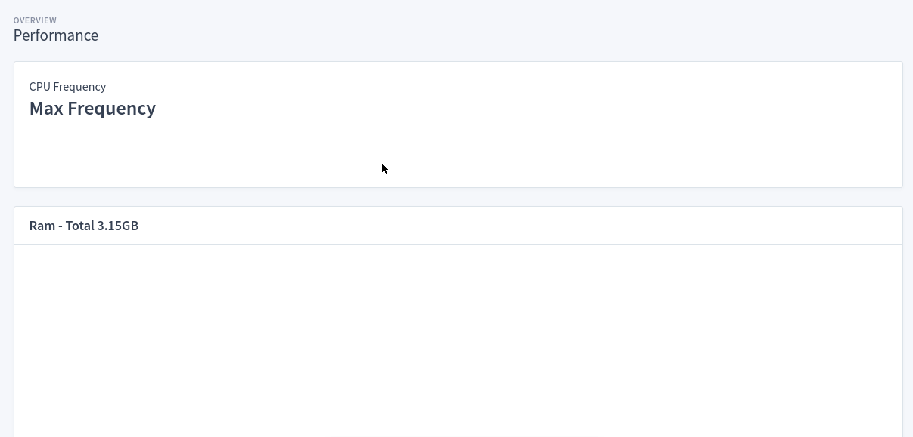
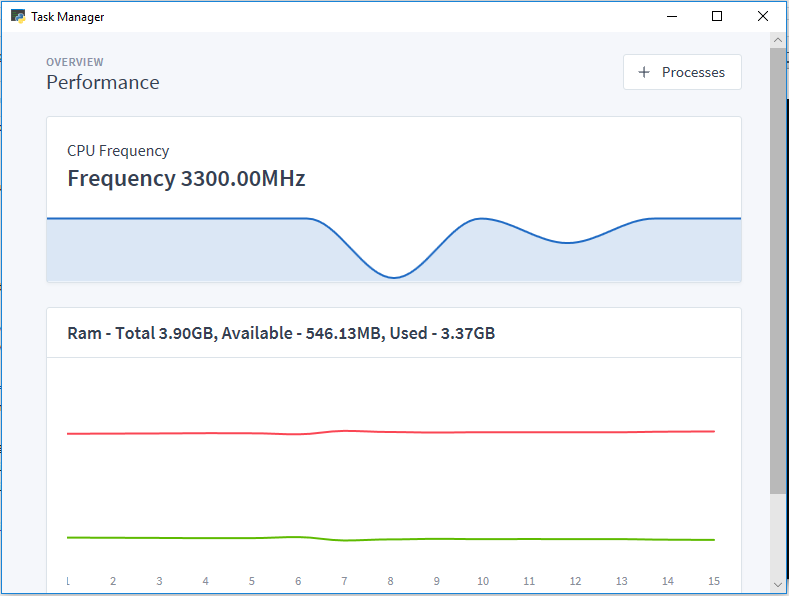
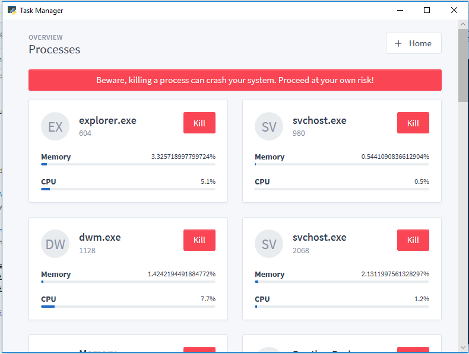

# Task manager

~Use Python to check basic computer stats and graph them
More like task manager, but in a browser - *You can't kill tasks tho*~

You can now kill tasks, you've got a gui task manager!

# Requirements
```
flask
psutil
pywebview
```

# Working



# On Windows



